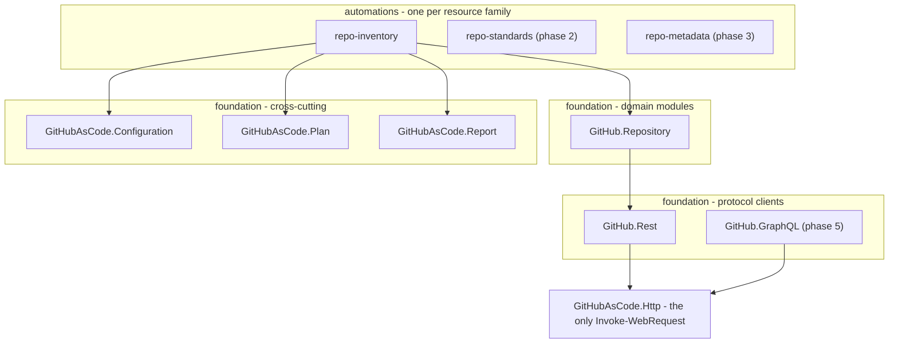

# GitHub as Code

Declarative, reviewable auditing of a GitHub account in pure PowerShell against the
REST API, with no runtime dependency beyond PowerShell itself.

Every change is planned before it is applied, nothing is ever deleted, and no credential
is ever committed.

```powershell
.\automations\repo-inventory\Invoke-RepositoryInventory.ps1 -Command validate   # offline, no token
.\automations\repo-inventory\Invoke-RepositoryInventory.ps1 -Command inventory  # what exists today
.\automations\repo-inventory\Invoke-RepositoryInventory.ps1 -Command plan       # declared vs live
```

---

## The problem

An account accumulates repositories the way a drawer accumulates cables. Each one made
sense on the day it was made; collectively, nothing states how any of them should be
configured, and nobody can answer *"is my account set up the way I intend?"*

Measured against one real account, to show the shape of the problem:

| Fact | Number |
| --- | --- |
| Repositories owned | **24** |
| **Private, and therefore invisible to any unauthenticated view** | **9** |
| With at least one topic | **0** |
| With a licence | **2** |
| With `has_projects` on because nobody turned it off | 24 |

Full version: [docs/overview/problem-statement.md](docs/overview/problem-statement.md).

## Why it is harder than it looks

Several behaviours of the GitHub API turn "just automate it" into a real design problem.
Each has an implementation that appears to work and destroys something.

| The API behaviour | The obvious implementation | What it destroys |
| --- | --- | --- |
| `GET /users/{user}/repos` returns **public repositories only** | Enumerate the account through the endpoint with the user's name in it | Nothing visible - which is the problem. **Measured: it hid a third of the account.** Every private repository vanishes from an inventory that reports itself complete, and a decision gets made from it |
| `PUT /repos/{o}/{r}/topics` replaces the whole collection - no per-topic route | Send the declared topics | Every topic somebody added and nobody wrote down |
| `enforce_admins` plus one required review, on a single-owner repository | "Let us protect `main` properly" | `main` becomes unmergeable. You cannot approve your own pull request, admin enforcement admits no bypass, and the only way out is the web interface |
| A GraphQL error arrives as **HTTP 200** with an `errors` array | `if ($status -eq 200) { use $data }` | A `FORBIDDEN` reads as an empty result, so the report states a fabricated fact instead of admitting it could not read |

[docs/reference/github-notes.md](docs/reference/github-notes.md) documents fourteen such
behaviours, each with the symptom it produces. Two are marked *measured* rather than
*documented*, because they were observed live against a real account rather than read in
the documentation.

## Approach

| Principle | In practice |
| --- | --- |
| **Declare, then plan, then apply** | `plan` writes nothing. `apply` does not exist yet, and when it does it will need `-ConfirmApply` and will refuse a plan with any blocked operation |
| **Never delete** | Every writer is additive. A collection is written as the **union** of live and declared, and the undeclared members are reported as preserved rather than removed |
| **Names, not values** | The configuration declares the *name* of the environment variable holding a secret - and of the one holding the account login - so the whole declaration is committable |
| **Idempotent by design** | A change is done when a second `plan` reports nothing pending. Drift is defined against the *payload that would be sent*, not against the declaration, which is what makes a second run a genuine no-op |
| **The credential cannot do the worst thing** | Fine-grained tokens only: there is **no fine-grained permission equivalent to deleting a repository**, so the token type removes the capability rather than restricting it |

## Architecture



Dependencies point downward, never sideways. The shared layer carries no domain rules -
the moment it grows an `if this is a repository` branch it has become a monolith with
extra steps. One HTTP layer with two protocol clients above it, because what REST and
GraphQL share is transport while what differs (a status code against an `errors` array,
`Link` against a cursor, requests against points) is domain.
See [docs/reference/architecture.md](docs/reference/architecture.md) and
[ADR 0002](docs/adr/0002-two-clients-one-http.md).

## Modules

| Module | Owns | Guide |
| --- | --- | --- |
| `repo-inventory` | Every repository the account owns, and how live state differs from the declaration | [guide](automations/repo-inventory/README.md) |

Phases 2 to 5 add `repo-standards` (the files a repository of each class must have),
`repo-metadata` (description, homepage, topics, labels), `repo-protection` (**plan-only,
permanently**) and `project-board` (Projects v2, over GraphQL).

Every module exposes the same ladder:

| Command | Reads live state | Writes | Confirmation | Available |
| --- | --- | --- | --- | --- |
| `validate` | No | No | - | Yes |
| `inventory` | Yes | No | - | Yes |
| `plan` | Yes | No | - | Yes |
| `smoke` | Yes | No | - | Yes |
| `apply` | Yes | **Yes** | `-ConfirmApply` | Phase 3 |

**There is currently no code path that writes.** Not by convention:
`GitHubAsCode.Http` has no `-Method` parameter, and an absence test walks the parse tree
asserting the word appears as neither a parameter nor a hashtable key anywhere in the
repository. Widening that is [ADR 0001](docs/adr/0001-write-boundary.md), not an edit.

## Quickstart

```powershell
# 1. Prepare the workstation. Checks prerequisites, creates .env from the template.
.\scripts\bootstrap.ps1

# 2. Check the declaration - offline, no credentials needed
.\automations\repo-inventory\Invoke-RepositoryInventory.ps1 -Command validate

# 3. Fill in GITHUB_OWNER and GITHUB_TOKEN_READ in .env

# 4. See what exists
.\automations\repo-inventory\Invoke-RepositoryInventory.ps1 -Command inventory

# 5. Derive the declaration from the report, then plan - twice
.\automations\repo-inventory\Invoke-RepositoryInventory.ps1 -Command plan
.\automations\repo-inventory\Invoke-RepositoryInventory.ps1 -Command plan
```

Step 5 twice is not a typo. A second `plan` reporting the same operations is what proves
the inventory and the comparison agree, and that is what makes any later finding
believable.

Full walkthrough: [docs/guides/getting-started.md](docs/guides/getting-started.md).
When something goes wrong: [docs/guides/troubleshooting.md](docs/guides/troubleshooting.md).

### What goes in `.env`

Configuration files declare the **name** of a value; only
[.env.example](.env.example) holds values, and it ships with every token empty.

| Variable | Needed by | Notes |
| --- | --- | --- |
| `GITHUB_API_URL` | everything past `validate` | `https://api.github.com`, or the `/api/v3` root on Enterprise Server |
| `GITHUB_OWNER` | everything past `validate` | The login only. An environment variable rather than a config value, because an account name is identifying data and the config is committed |
| `GITHUB_TOKEN_READ` | everything past `validate` | **The only one phase 1 needs.** Fine-grained, read-only |
| `GITHUB_TOKEN_WRITE_METADATA`, `GITHUB_TOKEN_WRITE_CONTENT`, `GITHUB_TOKEN_PROJECTS` | phases 3 to 5 | Empty until then. One token per role, so an automation cannot reach past its job |

## What a clean plan looks like

Not "all `ok`".

```
pending   = 0
blocked   = 0
protected = non-zero, and the SAME number as the previous run
```

A stable non-zero `protected` count is a healthy account: it is the tool consistently
declining to remove things nobody declared. A count that moves over an unchanged account
means the tool is not reading the account the same way twice.

## Quality gate

```powershell
.\scripts\Invoke-Tests.ps1
```

Parse check, PSScriptAnalyzer (warnings fail), the Pester suite, and a sensitive data
scan. Continuous integration runs the identical command on `windows-latest` under both
`powershell` and `pwsh`, so "it passed locally" and "it passed in CI" mean the same
thing.

Running the automations needs nothing but PowerShell. Running the **gate** needs two
modules:

```powershell
Install-Module Pester -MinimumVersion 5.5 -MaximumVersion 5.99.99 -Scope CurrentUser
Install-Module PSScriptAnalyzer -Scope CurrentUser
```

The upper bound is deliberate: Pester 6 has shipped, and a suite running outside its
tested range is not making the same claim as one running inside it.

## What this repository demonstrates

- **Designing around an API that punishes the obvious implementation.** Fourteen
  documented behaviours, each handled with a measured guard rather than a hopeful one,
  and each covered by a test that names the failure it prevents.
- **Absence tested from the parse tree, not from text.** No write, no `DELETE`, no
  `users/` path, no unbounded `ConvertTo-Json`, no hashtable key that looks like a
  destructive `PATCH` field. A grep matches prose and misses a variable; `-Method $verb`
  is how a write would actually arrive.
- **Idempotency as a design constraint.** Drift is defined against the payload that
  would be sent, so a second run is a genuine no-op - and that is asserted offline from
  a fixture rather than promised in a document.
- **Security as a property of the credential, not of the code.** Fine-grained tokens
  cannot delete a repository at all, which is a stronger statement than any guard in
  this repository can make about code nobody has written yet.
- **Documentation as a deliverable.** Problem statement, capability catalogue, scope and
  limits with a reason per refusal, five ADRs, and a per-module guide that has to say how
  to reverse what it did - with CI failing on an unindexed document.

## Repository layout

| Path | Contains |
| --- | --- |
| `foundation/` | The shared layer: six modules, the project context, and the loader |
| `automations/` | One directory per automation: entry point, config, schemas, guide |
| `scripts/` | `bootstrap.ps1`, `Invoke-Tests.ps1`, `Test-NoSensitiveData.ps1` |
| `tests/` | Pester suite and invented fixtures |
| `docs/` | [Documentation index](docs/README.md) |
| `.github/workflows/` | The quality gate that runs on every push and pull request |
| `.env.example` | Template for `.env`, and the only place variable values are named |
| `PSScriptAnalyzerSettings.psd1` | Analyzer rules, each exclusion with its reason beside it |
| `.local/` | Workstation scratch space. Ignored by Git; may hold real credentials |
| `artifacts/` | Reports and run logs. Ignored by Git |

## Scope

One resource family, covered properly, rather than every resource covered thinly.

Deliberately **not implemented**, because the operation cannot be made safe: deleting
anything at all, changing visibility, archiving, renaming, transferring, writing an
Actions secret, and applying branch protection.
[docs/overview/scope-and-limits.md](docs/overview/scope-and-limits.md) gives the reason
for each.

## Using this template

This repository is a GitHub **template**. Generate one from it, then follow
[docs/guides/using-this-template.md](docs/guides/using-this-template.md): replace
`TEMPLATE-AUTHOR` in the module manifests, put your name on the `LICENSE`, define the
repository classes that match your account, and derive your declaration from your own
first `inventory` run.

Everything in `docs/` describes the method. The numbers in it come from one real account
and are there to show that the API traps are real rather than theoretical - your baseline
will be different, and [problem-statement.md](docs/overview/problem-statement.md) has the
commands to measure it.

## Notes

The foundation, command ladder and automation contract come from two sibling projects
that apply the same pattern to a Jenkins controller and to Azure DevOps. The provenance
is recorded where it explains a decision - see `AGENTS.md` and the changelog - because a
rule without its reason is the first thing somebody removes.

Licensed under the [MIT License](LICENSE). Security policy:
[SECURITY.md](SECURITY.md). Contributing: [CONTRIBUTING.md](CONTRIBUTING.md).
