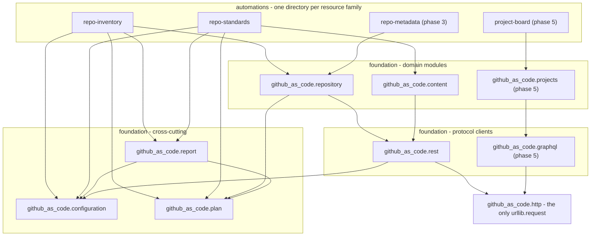

# Architecture

**Purpose.** Say which layer a piece of code belongs in, and why the boundary is where
it is.

**Scope.** `foundation/` and `automations/`.

**Audience.** Anyone adding a module or wondering where something should live.

## The layers

Dependencies point downward, never sideways - and a guard checks it. Imports are
statically enumerable, so `tests/python/test_layering.py` reads a ladder from
`pyproject.toml` and fails the gate on an import that points sideways or up. It was a
convention nothing enforced until the port made it checkable.

The ladder is finer-grained than the bands below, because the bands are coarser than the
truth. `github_as_code.report` requires `github_as_code.plan` and
`github_as_code.configuration`, and all three sit in the cross-cutting band, so the band
grouping alone would read those edges as sideways. The edges are drawn now - they were
missing from this diagram while the manifests declared them, which is the kind of gap a
diagram keeps quietly.

## What goes where

| Layer | Rule |
| --- | --- |
| `github_as_code.configuration` / `.plan` / `.report` | Cross-cutting. **Knows nothing about GitHub.** No URL, no endpoint, no permission name, no status code meaning. |
| `github_as_code.rest` / `github_as_code.graphql` | Protocol semantics: how a request is addressed, how a page is followed, how a failure is recognised. |
| `github_as_code.repository` / `.content` / `.projects` | Domain rules, as pure functions over values. No network. |
| `automations/*` | Orchestration and reporting. Reuses the foundation; adds nothing domain-specific to it. |

The moment the shared layer grows an `if this is a repository` branch, it has become a
monolith with extra steps. If your module seems to need a special case in the shared
layer, the logic belongs in your module.

## Why one HTTP layer and two clients

The decision, in full, is [ADR 0002](../adr/0002-two-clients-one-http.md). The short
version:

What REST and GraphQL **share** is pure transport - the authorization header, retry,
timeout, TLS floor, redirect refusal, the raw-bytes UTF-8 decode. That is cross-cutting,
and it lives in `github_as_code.http`, which is the single file that imports
`urllib.request`. One place to audit, and one place a write could ever be added.

What **differs** is how a failure is recognised, and it is not a small difference:

| | REST v3 | GraphQL v4 |
| --- | --- | --- |
| Addressing | many paths | one endpoint |
| Failure | a status code | **HTTP 200 with an `errors` array** |
| Pagination | `Link` header | `pageInfo.endCursor` |
| Rate limit | requests per hour | **points** per hour |

None of that is transport, and sharing the rate limit counter between the two would be
straightforwardly incorrect - they are separate budgets. So the split follows the rule:
the shared layer holds the arithmetic (`retry_decision` is a pure function over
numbers), and the domain client holds the meaning (`github_as_code.rest` reads
`x-ratelimit-remaining` and knows what it implies).

## Why pure functions

`github_as_code.repository` has no network access at all. That is not a testing convenience -
it is what makes the idempotency claim testable. Drift is defined against **the payload
that would be sent**, not against the declaration, so if the payload is a pure value,
drift is a comparison of values and a second plan can be asserted offline from a
fixture. See [testing-strategy.md](../process/testing-strategy.md).

## The loader

`src/github_as_code/` is **dot-sourced**, so it shares the caller's scope.
Every variable in it is prefixed for that reason: an unprefixed `$Name` parameter once
gave every caller a `[string[]]`-typed `$Name`, and a caller assigning a string to it
silently got back a one-element array - failing three layers away with "Cannot convert
value to type System.String".

Modules are imported in dependency order, because `RequiredModules` resolution failing
out of order reports an error naming the wrong module.
